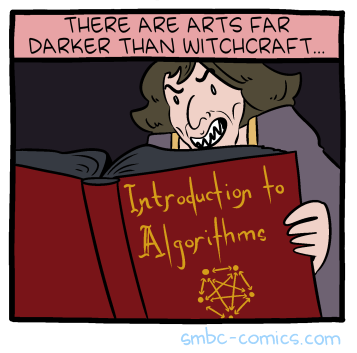

# CSCI046: Data Structures and Algorithms

message for second section

<!-- created on github -->

## About the Instructor

|||
|---------------|-------------------------------|
| Name          | Mike Izbicki (call me Mike)   |
| Email         | mizbicki@cmc.edu              |
| Office        | Adams 216                     |
| Office Hours  | See [Issue #416](https://github.com/mikeizbicki/cmc-csci046/issues/416) |
| Zoom          | See [Issue #325](https://github.com/mikeizbicki/cmc-csci046/issues/325) |
| Webpage       | [izbicki.me](https://izbicki.me) |
| Research      | Machine Learning (see [izbicki.me/research.html](https://izbicki.me/research.html) for some past projects) |

Fun facts:
1. grew up in San Clemente (~1hr south of Claremont, on the beach)
1. 7 years in the navy
    1. nuclear submarine officer, personally converted >10g of uranium into pure energy
    1. worked at National Security Agency (NSA)
    1. left Navy as a [conscientious objector](https://www.nytimes.com/2011/02/23/nyregion/23objector.html)
1. phd/postdoc at UC Riverside
1. taught in [DPRK (i.e. North Korea)](https://pust.co)
1. my wife is pregnant and due to have a baby April 18th
    1. I will take 2 weeks off for paternity leave when the baby comes

## About the Course

Data structures is the most important course in computer science,
and many of the "classic" CS interview questions come from this course.
Mastering this material is the first step towards getting a high-paying CS job.
See:
1. Salaries: <https://www.levels.fyi>
1. Benefits: <https://www.levels.fyi/benefits/Paternity-Leave/>
1. [This is despite tech employers illegally colluding to reduce salaries](https://en.wikipedia.org/wiki/High-Tech_Employee_Antitrust_Litigation)

**Who should take this course?**

1. This is a second-semester course in computer science designed for students who have previously taken either CS40 (CMC), CS5 (Mudd), or CS51 (Pomona).

1. You cannot take this course if:
    1. you have already taken a data structures course
       (e.g. Pomona: CS62; HMC: CS60, CS70), or
    1. you are a CS major through Mudd or Pomona.

1. This course is required for CMC's **data science major** and the computer science sequence.
   It is optional for the data science sequence.

**Learning Objectives:**

1. Learn basic the basics of
    1. linux terminal 
    1. git
    1. open source software

1. Be able to answer the following three questions about an algorithm:
    1. Is it correct?
    1. How much resources does it consume? (time, memory, money, etc.)
    1. Can we do better?

<!--
Secondary objectives:

1. More experience with python programming
1. Solve the questions asked in programming interviews and contests
1. Introduction to the hacker culture

Differences between this course and HMC's CSCI060HM/CSCI070HM:

1. This course does not cover low-level memory management (C/C++ programming languages)
1. This course is more practical
-->

This course is NOT an algorithms course.
Algorithms courses form the "other half" of classic CS interview questions,
and you should consider taking [CS148 - Graph Algorithms](https://catalog.claremontmckenna.edu/preview_course_nopop.php?catoid=25&coid=31723) after this course.

**Textbook:**

All of our textbooks are both [free as in beer](https://en.wiktionary.org/wiki/free_as_in_beer) and [free as in speech](https://en.wiktionary.org/wiki/free_as_in_speech):

1. [Problem Solving with Algorithms and Data Structures using Python](https://runestone.academy/runestone/books/published/pythonds/index.html) by Brad Miller and David Ranum

1. [Official Python Documentation](https://docs.python.org/)

**Grades:**

Your grade will be composed of:

1. Weekly labs (worth `2**1` points)
1. Weekly quizzes (worth `2**2` or `2**3` or `2**4` points)
1. Weekly projects (worth `2**3` or `2**4` or `2**5` points)
1. No exams!!!
    1. Non-graduating students will complete a final project due during finals week.
1. [Occasional extra credit assignments](extra_credit/README.md)

Historically, the average student needs to spend about 10 hours per week (outside of class) to get an A.
   About 25% of students will either:
   spend 15-20 hours per week and get an A,
   or spend 10 hours per week and get a B/C.

**Late Work Policy:**

You lose `2**i` points on every assignment,
where `i` is the number of days late minus 1.

> **Example:**
> Homeworks will be due on Tuesdays, so if you submit on Wednesday then `i=0` and you receive a `2**0` (i.e. `1`) point penalty.
> If you submit on Friday, you receive a `2**2` (i.e. 4) point penalty.

It is usually better to submit a correct assignment late than an incorrect one on time.

I expect that most students will be submit late assignments at some point.

**Grade Schedule:**

Your final grade will be computed according to the following table,
with one caveat.

| If your grade satisfies          | then you earn |
| -------------------------------- | ------------- |
| 95 &le; grade                    | A             |
| 90 &le; grade < 95               | A-            |
| 87 &le; grade < 90               | B+            |
| 83 &le; grade < 87               | B             |
| 80 &le; grade < 83               | B-            |
| 77 &le; grade < 80               | C+            |
| 73 &le; grade < 77               | C             |
| 70 &le; grade < 73               | C-            |
| 67 &le; grade < 70               | D+            |
| 63 &le; grade < 67               | D             |
| 60 &le; grade < 63               | D-            |
| 60 > grade                       | F             |

**Caveats:**

There are 2 "caveat tasks" in this course.
These tasks should be easy, and everyone will get full credit on the task just for completing the task.
If you don't complete one of the tasks, however, your grade (from the table above) will be docked 10%.
(For example, an A- grade would become a B- grade.) 
You have the entire semester (until I submit grades) to complete these tasks.

You can find the details about the caveat tasks at:
1. [caveat_tasks/typespeed.md](caveat_tasks/typespeed.md)
1. [caveat_tasks/culture.md](caveat_tasks/culture.md)

## Academic Integrity

**Technology Policy:**

1. You MUST complete all programming assignments on the lambda server.

1. You MUST use either vim or emacs to complete all programming assignments.
   In particular, you may not use the GitHub text editor, VSCode, IDLE, or PyCharm for any reason.

   In particular: You MAY NOT use the GitHub interface to edit files for a pull request.

1. You MAY NOT share your lambda server credentials with anyone else.

Violations of any of these policies will be treated as academic integrity violations.

**Collaboration Policy**

1. There are no restrictions on what you can post to GitHub Issues.
    In particular, you are highly encouraged to post detailed questions/answers/comments with lots of code.

1. You are highly encouraged to collaborate with students

    1. in class/lab,

    1. in the QCL,

    1. and in office hours.

1. You MAY NOT look at another student's code (or have another human look at your code) in any other context.

1. You MAY NOT look at another student's code on github.

    All projects are developed as open source projects,
    and so the code is published openly online.
    The benefits of this model include:
    (1) you actually learn how to develop/contribute to open source projects;
    (2) future employers see you have github activity.
    Please do not abuse this privillage.

## Accommodations Policy

I've tried to design the course to be as accessible as possible for people with disabilities.
(We'll talk a bit about how to design accessible software in class too!)
If you need any further accommodations, please ask.

I want you to succeed, and I'll make every effort to ensure that you can.

<!--

Next class should cover:

big pdf assignment:
    and/or short circuiting
    del lines[i] vs remove

word_ladder assignment:
    open the file
    del lines[i]

big-oh:
    big-o of the word ladder with set vs list
    memory usage O(1) vs O(n) vs O(n^2)
    accidentally quadratic

twitter: 
    sys.exit() and bash $?
    use the cowsay and fortune as an example for piping

in the sorting assignment, the _merge function is a dependency of quick_sorted();
passing the test cases for _merge guarantees that the function works,
but you can still get errors inside the function if you have errors outside the functiton

lab processes:

1. add discussion of how the HUP signal is sent differently for different OSes
2. limitted number of processes on the lambda server, show the fork resource exhausted error
3. killall/kill $(...) to kill processes
4. fork bomb
5. debug map.py by looking inside the nohup.out file
6. (un)buffered io, stdout vs stderr, redirection applies only to stdout

No `nohup.out` file in the repo.

introduce superclasses/static methods before the week on BSTs; it's too much to do it all at once; consider doing the deque class

Should probably do doubly linked list as Deque before doing BSTs

Demo something like the insert function in class; it's difficult for students to do the recursive inserts that modify the node values

Should add an insert/remove_min function to the BST/AVLTree class? as an analogy to the heap

Clarify which trees should have duplicates/no duplicates

Add tests to BST/AVLTree/Heap for runtime of operations

-->
<!--
See:
http://nifty.stanford.edu/2020/schwarz-recursion-to-the-rescue/
http://nifty.stanford.edu/2020/denero-typing-test/spec.html
-->

<!--
1. [Yes, the median salary at facebook is $240k](https://www.sfchronicle.com/business/networth/article/Yes-median-pay-at-Facebook-really-is-about-12870786.php)
1. [A detailed analysis of FAANG salaries](https://huyenchip.com/2020/01/18/tech-workers-19k-compensation-details.html), with raw data from [levels.fyi](https://www.levels.fyi/SE/Amazon/Google/Facebook/#)
1. [The high-tech employee antitrust litigation](https://en.wikipedia.org/wiki/High-Tech_Employee_Antitrust_Litigation)
1. [Get jobs from GitHub/HackerNews](https://news.ycombinator.com/item?id=22050802)
1. [/r/cscareerquestions](https://www.reddit.com/r/cscareerquestions/top/)

Other technical articles:

1. [Command-line tools can be faster than a hadoop cluster](https://news.ycombinator.com/item?id=22188877)
1. [intermediate vim](https://dn.ht/intermediate-vim/)
1. [Mike's dotfiles](https://github.com/mikeizbicki/dotfiles)
1. [The missing semester of CS education](https://news.ycombinator.com/item?id=22226380)
1. [Larry Wall's three virtures of a programmer](http://threevirtues.com/)
1. [accidentally quadratic blog](https://accidentallyquadratic.tumblr.com/post/161243900944/mercurial-changegroup-application) and a [windows bug caused by an O(n^2) algorithm](https://news.ycombinator.com/item?id=21743424)
1. [the history of git](https://www.welcometothejungle.com/en/articles/btc-history-git)
1. [timsort](https://svn.python.org/projects/python/trunk/Objects/listsort.txt) - Tim's [Zen of Python](http://www.openbookproject.net/books/bpp4awd/_static/ch10/zen.html)
1. [stackoverflow - why processing sorted arrays is faster even in linear search](https://stackoverflow.com/questions/11227809/why-is-processing-a-sorted-array-faster-than-processing-an-unsorted-array)

1. [What every programmer should know about floating-point](https://floating-point-gui.de/)
1. [The lat/lon floating point delusion](https://www.datafix.com.au/BASHing/2019-08-09.html)
1. [The fallacy of premature optimization](https://ubiquity.acm.org/article.cfm?id=1513451)
1. [Computer Science from the Bottom Up](https://www.bottomupcs.com/index.xhtml)

1. https://choosealicense.com/

Library documentation:

1. [timeit](https://docs.python.org/3/library/timeit.html)
1. [collections](https://docs.python.org/3/library/collections.html)
1. [copy](https://docs.python.org/3/library/copy.html)
1. [traceback](https://docs.python.org/3/library/traceback.html)

Programming games:

1. https://vim-adventures.com/
1. The [git game](https://github.com/git-game/git-game) and [git game v2](https://github.com/git-game/git-game-v2)
1. `typespeed` (type this command on the lambda server)
1. [bandit wargames](https://overthewire.org/wargames/bandit/bandit0.html)
-->

