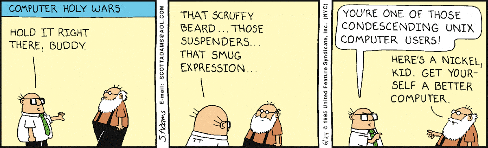

# Topic 00: Unix and the open source workflow

<center>
<a href="https://www.reddit.com/r/linuxmasterrace/comments/3las1l/dilbert_had_it_right_back_in_1995/">

</a>
</center>

## Lecture

We will cover

1. working on a remote unix server
1. using the git version control system
1. using continuous integration to "prove" that your code works

**Cheat sheets:**

1. [bash](https://files.fosswire.com/2007/08/fwunixref.pdf)
1. [vim](https://github.com/mikeizbicki/ucr-cs100/blob/class-template/textbook/cheatsheets/vim-cheatsheet.pdf)
1. [git](https://education.github.com/git-cheat-sheet-education.pdf)
1. [github pull requests](pull_request.png)

**Quiz details:**

1. There will be a quiz every Wednesday.
1. Your first quiz is next week on Wednesday 9 Sep.
1. The quiz will cover:
    <https://github.com/mikeizbicki/quiz/blob/master/quiz_shell/topic00_intro_quiz.pdf>
1. All quizzes are open note.
    I strongly encourage you to complete all of the practice quiz problems and take notes on the practice sheets of paper.

## Lab

**Due date:**

Labs are always due on midnight of the Sunday of the week that they are assigned (i.e. Sep 6 for this lab).

*For this lab only: There will be no late penalty if you miss the due date, but please be reasonable.*

**Pre-lab work:**

1. Create a GitHub account if you do not already have one.
    Press the watch button on both this repo and <https://github.com/mikeizbicki/about-me>.
    This will ensure you get email notifications whenever I post new issues to github.

1. Read and follow the instructions in [the meet and greet issue](https://github.com/mikeizbicki/cmc-csci046/issues/568).

1. Log in to the lambda server.
   Run the command
   ```
   $ vimtutor
   ```
   Complete all instructions in order to learn vim.
   This should take 30-60 minutes.

   Vim is famous for having a steep learning curve,
   and has inspired lots of memes/comics:

   

   

   

**Instructions:**

1. Visit the [messages](https://github.com/mikeizbicki/messages) repo and complete the instructions in the README.

1. Complete the [unix/git tutorial](github.com/mikeizbicki/lab-unix-git).

1. Follow [these instructions](lambda-server.md) to update your lambda server account's settings.

1. Complete the [github pull request tutorial](https://github.com/mikeizbicki/pullrequest-tutorial/).

<!--
**Lab Submission:**

Submit a link to your pull request in sakai.
(I need the link since your github usernames are pseudonymous, and I won't know who to give credit for the lab without the link.)
-->

## Homework

Homeworks will generally be posted into the `homework` [git submodule](https://www.atlassian.com/git/tutorials/git-submodule) for each week.
Homeworks are always due on Tuesday of the week after they are assigned (i.e. Sep 8 for this homework).

*For this hw only: There will be no late penalty if you miss the due date, but please be reasonable.*
