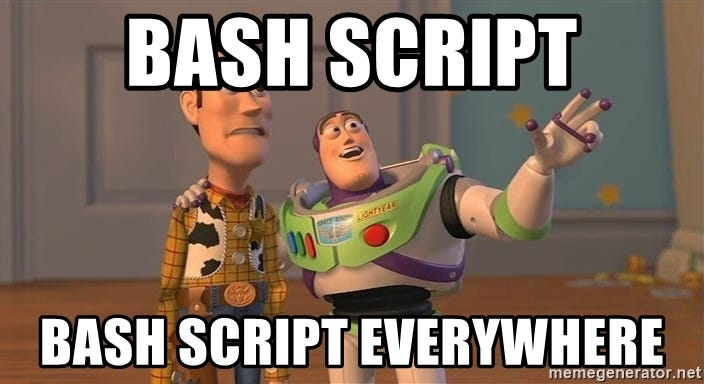
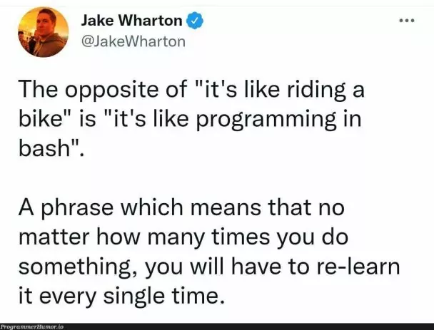

# AVL Trees

**Announcements:**

Recall:
1. Quiz this Wednesday on OOP II
1. BST assignment due Thursday instead of Tuesday
1. My baby is due Apr 18
    1. 2 week paternity leave => no class rest of the end of semester

        (if baby comes on the due date)
    1. Tentative Homework Schedule:

        > **My guarantee:**
        > Nothing will be due before the dates listed below.
        > Some things may be due later.

        Mar 23: BST Tree

        Mar 28: AVL Tree

        Apr 04: Heap

        Apr 11: Graphs (Risk board game AI)

        Apr 18: ---

        Apr 25: ---

        May 2: MapReduce project (parallel processing of 3 terabytes of tweets)

        May 12: (non-graduating students only) Async programming (Fast Wardialing)


There are 2 videos about AVL trees below to use for your assignment.

1. <https://www.youtube.com/watch?v=U3_ipnPYmXg&list=PLSNWQVdrBwobmS9cowxAldNTEtx0ndsF5&index=23&t=851s>
1. <https://www.youtube.com/watch?v=a_VJbPyXaWk&list=PLSNWQVdrBwobmS9cowxAldNTEtx0ndsF5&index=22>

This week in class, we will focus on quiz material:

1. POSIX = Portable Operating System Interface

    Invented in 1970s

    Works on all computers (Windows added support in 2016)

1. Advantage: Very useful for automating tasks
    1. Your computer runs hundreds of shell scripts on startup
    1. Easy to process HUGE datasets quickly (via MapReduce)
    1. 100 line python programs can be done in 1 line of shell
    1. One of the most popular programming languages: <https://survey.stackoverflow.co/2022/#most-popular-technologies-language>

    
    

    (Sometimes called "bash" scripting instead of "POSIX" or "shell" scripting.)

1. Disadvantage: it's very weird

    

---


<br>
<br>


Textbook Reference: [Chapters 7.15-7.17](https://runestone.academy/runestone/books/published/pythonds/Trees/BalancedBinarySearchTrees.html)

## BST runtimes

The BST is "usually" good, but it can become "unbalanced", resulting in poor performance.

**Theorem:**
The runtime of find/insert/delete on any BST is O(height).
(More specifically, the best-case runtime is $\Theta(1)$ and the worst-case runtime is $\Theta$(height).)

**Property:**
The height of any BST is both $O(n)$ and $\Omega(\log n)$.
These bounds are tight and cannot be improved.

**Corollary:**
The runtime of find/insert/delete on any BST is $O(n)$.

## Self-balancing BST

[Self-Balancing BSTs](https://en.wikipedia.org/wiki/Self-balancing_binary_search_tree) are a class of data structures that fix these problems

1. We will study the AVL Tree 

    1. invented in 1962 by Soviet scientists Adelson-Velsky and Landis
    1. one of the first and particularly simple

1. Red-black trees are also popular in data structures classes
    1. invented in 1972 by West German Rudolf Bayer
    1. a bit more complex than AVL trees

1. Other examples include

    1. 2-3 tree
    1. AA tree
    1. B-tree
    1. Scapegoat tree
    1. Splay tree
    1. Tango tree
    1. Treap
    1. Weight-balanced tree

1. All of these data structures add new invariants that somehow enforce that the tree be balanced

    1. The AVL invariant is particularly simple:

       The `balance_factor` of every node must be either -1, 0, or 1, where

       ```
       balance_factor = height(left subtree) - height(right subtree)
       ```

    1. **Theorem:**
       Every tree satisfying the AVL invariant has height $\Theta(\log n)$.

       Proof in textbook chapter 17.16.

    1. **Corollary:**
       The find/insert/delete operations take time $O(\log n)$.

1. In your homework:

    1. The `AVLTree` class will be a subclass of `BST`,
       because every AVL tree is also a BST

       1. This gives us `find`/`__contains__` operations "for free"

    1. You will have to implement:
        1. checking the AVL invariant
        1. left/right rotations
        1. inserting into the tree

    1. You will not have to implement deleting from the tree

## Lab

The lab is posted at: <https://github.com/mikeizbicki/lab-pipes-twitter>.

## Homework instructions

1. The <https://github.com/mikeizbicki/containers> repo has a new branch called `avltree`.
   This branch contains the homework for this week.

1. You should:

    1. Create and checkout a branch in your homework repo called `avltree`.
       `avltree` should be based off of the `bst` branch and not the `master` branch.

       > **IMPORTANT:**
       > The code in your `avltree` branch will require that you have access to your `BinaryTree` and `BST` classes.
       > If you don't have those classes because you didn't base your `avltree` branch off of `bst`, the code won't work.
       > All your work must be done in the `avltree` branch,
       > and you must not merge your work into any other branch.
       > If any other branch is modified,
       > you will receie a -8 point penalty on this assignment.

       > **NOTE:**
       > You `avltree` branch will no longer be passing the BST test cases,
       > and so will have a read test case badge on the `avltree` branch.
       > The the test case badges are not branch specific, however, but apply to any test cases on any branch.
       > This means that the test case badge on the `bst` branch will turn red.
       > This is expacted behavior, and will not affect your grade on the BST assignment.
       > When you get the `avltree` branch passing the test case,
       > it will also fix the test case on the `bst` branch.
       > Later in the course we will see how to adjust the urls in the badges to make them branch specific.

    1. Pull the contents of my `avltree` branch into your branch.

       > **IMPORTANT:**
       > My `avltree` branch contains modifications to both the `containers/BST.py` file and the `tests/test_BST.py` file.
       > You will likely have a merge conflict on the former file (because we've both made changes to it) that you'll have to resolve;
       > you shouldn't have a merge conflict on the latter file because you shouldn't have made any changes to the test cases.
       > You will also see that your `BinaryTree` test cases continue to pass (green badge),
       > but that the test cases for your `BST` are now failing (red badge).
       > This is because I've added a new method `__eq__` to the `BST` class that you must implement, and it has corresponding test cases.

    1. Fix the file `containers/BST.py` and `containers/AVLTree.py` so that all the test cases pass.

    1. Update your `README.md` file to include build status icons for the AVLTree.

1. Submit the link to your `avltree` branch on github to sakai.

   > **IMPORTANT:**
   > If you submit a link to any other branch instead,
   > you will receive a -8 point penalty on the assignment.
